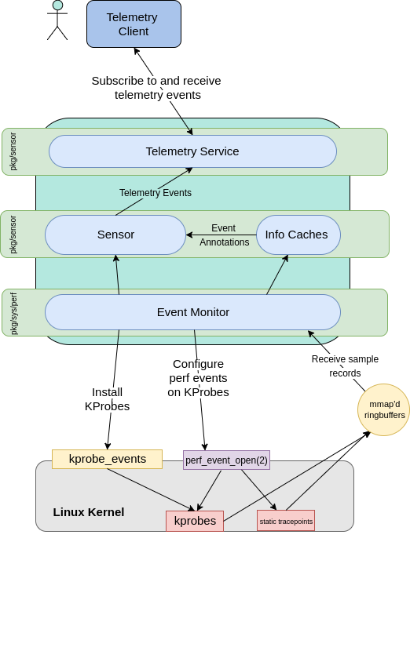

# Capsule8 Sensor Architecture 

## Table of contents
  
  * [Diagram](#diagram)
  * [Components](#components)

### Diagram:

### Components:

- __Perf__ - Tool inside of the linux kernel that can instrument CPU performance counters, tracepoints, kprobes, and uprobes of which capsule8 does/will utilize for extracting [telemetry events](Definitions.md). Essentially it's the interface that the kernel exposes for tracing subsystems.

  - __perf_event_open (2)__ - System call interface to perf. Used to set up mmap'd ringbuffer for getting kernel sample records into userspace.

- __kprobe_events__ - The file within the tracefs file system where kprobes are written. Typically located at `/sys/kernel/debug/tracing`.

- __Event Monitor__ - A Go friendly library for interacting with perf. Found in [pkg/sys/perf](github.com/capsule8/capsule8/pkg/sys/perf).

- __Sensor (pkg/sensor)__ - Actual structural instance of the Capsule8 sensor's process. Contains handles on info caches. 

- __Info Caches__ - Clients to Event Monitor. These listen to streams of sample records while maintaing metadata caches. These emit annotations which are then packed into telemetry events. Found in [pkg/sensor](github.com/capsule8/capsule8/pkg/sensor).
 
- __Telemetry Service__ - A [grpc](https://grpc.io/) server that allows telemetry clients to send subscription objects and receive telemetry events.
